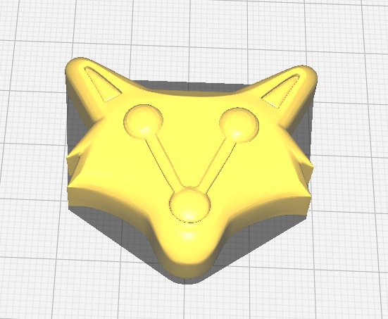
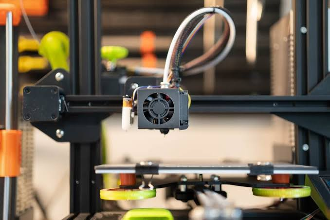
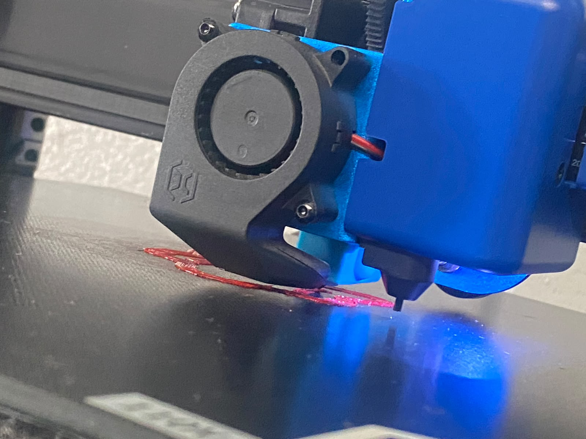

# 🖨️ Práctica de Impresión 3D — Modelado, Calibración e Impresión

### 🔧 Del diseño digital a una pieza física

**Modelado 3D · Preparación · Calibración · Impresión · Resultado final**

---

## 📌 Descripción

En esta práctica se realizó el **proceso completo de fabricación de una pieza mediante impresión 3D**, comenzando desde el **modelado de la pieza en un software de diseño 3D**, continuando con la preparación del modelo para la impresión y la **calibración de la impresora 3D**, hasta obtener el resultado final.

Durante la práctica se realizaron diferentes ajustes para conseguir una impresión adecuada y se documentó el proceso mediante **fotografías**.

---

## 🎯 Objetivos

* 🧩 Crear y preparar un modelo 3D.
* ⚙️ Configurar correctamente los parámetros de impresión.
* 📏 Realizar la calibración de la impresora 3D.
* 🖨️ Ejecutar el proceso de impresión.
* 🔍 Analizar el resultado obtenido.
* 📸 Documentar el proceso mediante fotografías.

---

## 🔄 Proceso realizado

### 1️⃣ Modelado 3D

Se comenzó creando el modelo de la pieza en un software de diseño 3D.

📷 **Evidencia del modelado:**

---

### 2️⃣ Preparación del modelo

Una vez terminado el diseño, el modelo fue preparado para su impresión, realizando la configuración necesaria en el software de laminado.

Se configuraron parámetros como:

* Altura de capa
* Relleno
* Soportes
* Velocidad de impresión
* Temperatura
* Adhesión a la cama
* Orientación de la pieza

📷 **Evidencia de la preparación:**

La preparación del modelo se realizó como parte de la configuración previa a la impresión.

---

### 3️⃣ Calibración de la impresora

Antes de realizar la impresión se llevó a cabo la calibración de la impresora 3D para mejorar la precisión y calidad de la pieza.

Se verificaron aspectos como:

* Nivelación de la cama
* Primera capa
* Extrusión
* Temperatura
* Adhesión
* Parámetros de impresión

📷 **Evidencia de la calibración:**

---

### 4️⃣ Impresión 3D

Después de completar la configuración y calibración, se inició la impresión de la pieza.

Durante este proceso se supervisó el funcionamiento de la impresora y la calidad de las capas.

📷 **Proceso de impresión:**

---

## 📸 Galería

---

## 🛠️ Herramientas utilizadas

| Herramienta                 | Uso                        |
| --------------------------- | -------------------------- |
| 🖥️ Software de modelado 3D | Diseño de la pieza         |
| 🖥️ Software de laminado    | Preparación del modelo     |
| 🖨️ Impresora 3D            | Fabricación de la pieza    |
| 🧵 Filamento 3D             | Material utilizado         |
| 📏 Herramientas de medición | Verificación y calibración |

---

## 📚 Aprendizaje obtenido

Esta práctica permitió comprender de manera práctica el **flujo de trabajo de fabricación mediante impresión 3D**, desde la creación de un modelo digital hasta su transformación en una pieza física.

También permitió conocer la importancia de realizar una correcta **calibración de la impresora**, ya que factores como la nivelación, la primera capa, la temperatura y los parámetros de impresión influyen directamente en el resultado final.

---

## 👨‍💻 Autor

**Charlie Ramírez**

🎓 Bachillerato Técnico Vocacional en Desarrollo de Software

📅 **2026**

---

### 🖨️ Modelar → Calibrar → Imprimir → Crear

**Práctica de Impresión 3D · 2026**

